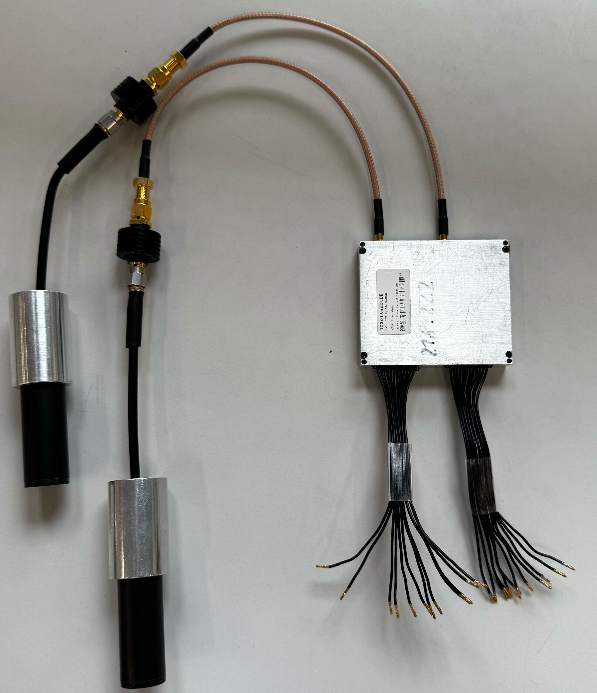
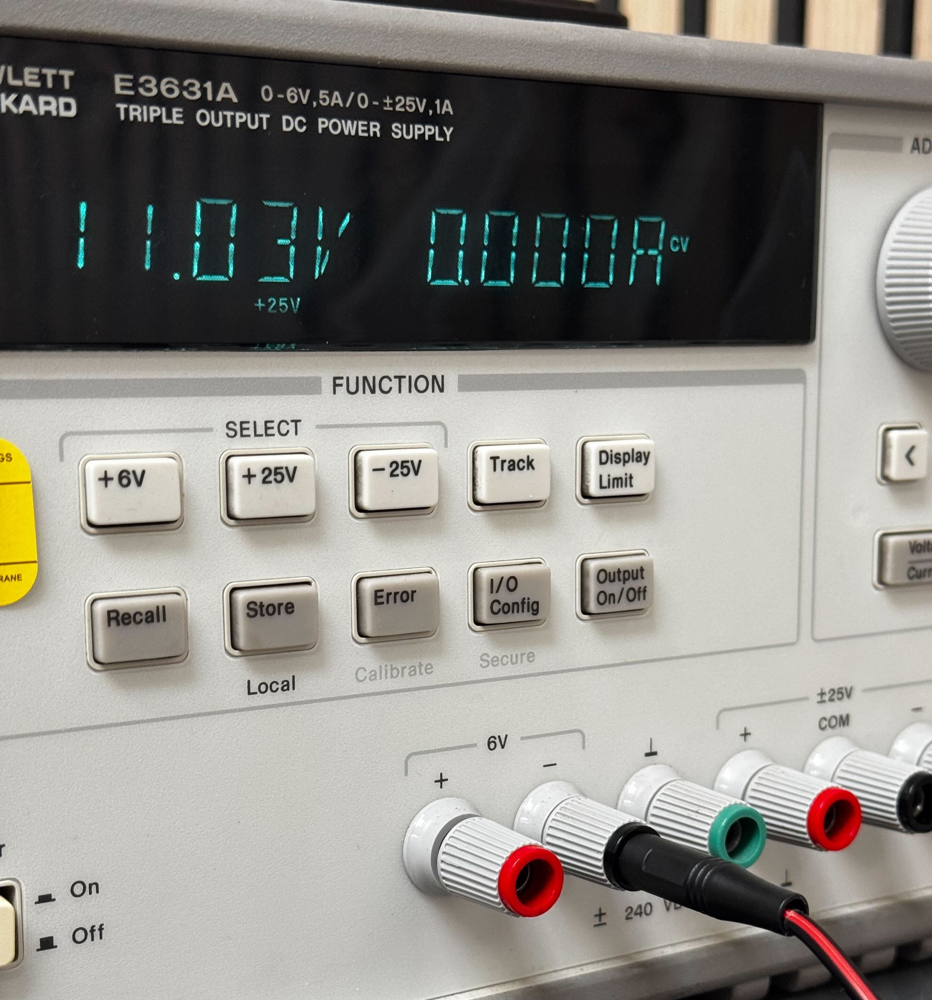
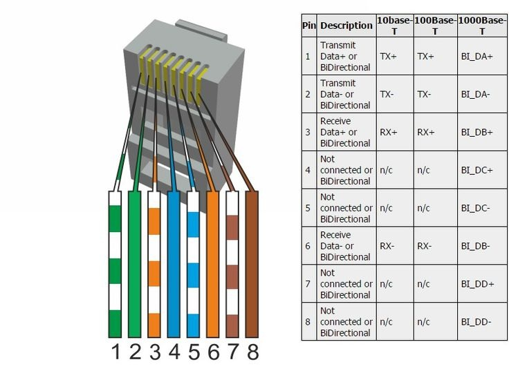

# Physical Connection without an Evaluation Board

Parts:

* 2 Doodle Labs Radios
* Connectors for the Radios
* Antennas for the Radios
* Ethernet Cable

Tools:

* Power Source - Battery or Bench Power Supply
* Multimeter
* Soldering Iron


It is reccomended to already have a working setup through the evaluation board as it simplifies the process of setting up and debugging the radio by eliminating some connection problems, such as a wrong pin connection.


### 1 Preparing the Cables

The main challenge of connecting a radio without an evaluation board is finding the correct pins and connecting them together. It is therefore key to locate the documentation for the radio you have, the process of which was described in this [guide](physical-connection-with-an-evaluation-board.md).

To power the radios, locate the PWR and GND pins. Most of the newer radios have more than one pin for PWR and GND. This is to distribute the load across several cables and pins as the connectors have a safe current rating of 1A per contact. Plug in a cable into each of the connectors.

<figure><figcaption></figcaption></figure>

Then use tweezers to remove te cables from the free connector. Insert the shart end under a plastic hinge above the metal and lift it up. Then it is possible to pull the cable out.

<figure><figcaption></figcaption></figure>

You should end up with something like this.

<figure><figcaption></figcaption></figure>


Expected Outcome: Connectors are plugged into a radio on one side and cables are exposed on the other.


### 2 Powering the Radio With a Power Supply

Locate all of the PWR/VCC/VDD/+ (equivalent terms in this context) and GND/- (angain equivalent) pins and connect them to a power source. The recommended way to do this is to solder all of the PWR or GND wires onto two thiccer cables. It is recommended to keep the convention of a red cable being the PWR/VCC and black being the GND/-.&#x20;

Next, there are three basic options of connecting the radio to a power supply.

#### 2.1 Bare Cable to Power Supply

Proceed by stripping the ends of the cable and connecting them to the power source, as shown below with an example of the - cable.



<figure><figcaption>
Stripped Cable
</figcaption></figure>




<figure><figcaption>
Stripped cable connected to a bench power supply
</figcaption></figure>



#### 2.2 Connector to Power Supply

A more reliable option is however to solder the correct connector at the end of each cable, which can then be plugged directly into the power supply terminal, as shown with an example of the - cable.



<figure><figcaption></figcaption></figure>



<figure><figcaption></figcaption></figure>



#### 2.3 Setting up the Power Supply

Lastly set the power supply to the correct voltage for the radio along with a sufficiently high current limit to deliver a maximum of 15 Watts.


Power (Watts) = Current (Ampers) \* Voltage (Volts)


However do not set it too high as if there is a wiring mistake, there is a higher chance of immidiately burning something. The radio will draw as much current as it needs, if it draws more, it will trigger the current limit and the voltage will start dropping. If the radio draws more then 15W, there is probably something wrong.


Expected Outcome: Power can be delivered to the radio.


#### 3 Connector to Battery

The last option is to solder a connector (in this case XT60), which can be plugged to a battery to power the radio on the go. However be careful that you are using the correct voltage to not damage the radio. A lower voltage can sometimes corrupt data on the radio while a higher one will probably burn it. If the battery and radio voltages are mismatched, you can for example use a [voltage regulator](https://en.wikipedia.org/wiki/Voltage_regulator) to supply the correct amount.

For a legacy radio model, which only requires one PWR and GND cable respectively, a connection might look something like the following.

<figure><figcaption></figcaption></figure>


Expected Outcome: Power can be delivered to the evaluation board from a battery on the go.


### 4 Connecting Ethernet

The next step is to connect ethernet pins to a cable. In this case, UXV Technologies is using a CUAV V6X flight controller with networking capablities and connected the radio using a 4-Pin JST-GH connector. Another common method of connecting ethernet is using the RJ-45 connector, which is easier to connect to a computer as a lot of them have a physical RJ-45 port (also simply called Ethernet Port).

Start by locating the ETH pins in the documentation and on the radio.

<figure><figcaption></figcaption></figure>

Then find the pinout of the target connector, in our case it is the ETH port on the CUAV V6X.



<figure><figcaption>
Pinout of the ETH port on the CUAV V6X
</figcaption></figure>



<figure><figcaption>
Pinout of the RJ-45 Ethernet connector
</figcaption></figure>



In this part, you need to be careful as the pins cannot be simply connected (RX+ to RX+). TX means transmit and RX receive, and each transmit pin needs to be connected to the receive pin of the corresponding polarity (TX+ -> RX+, TX- ->  RX-, RX+ -> TX+, RX- -> TX-). It is reccomended to solder the corresponding cables coming from the connectors together.&#x20;

A finished connector will look something like this:

<figure><figcaption></figcaption></figure>


Expected Outcome: A functioning connector, which can be used to power the radio and connect it through ethernet without the use of an evaluation board.

