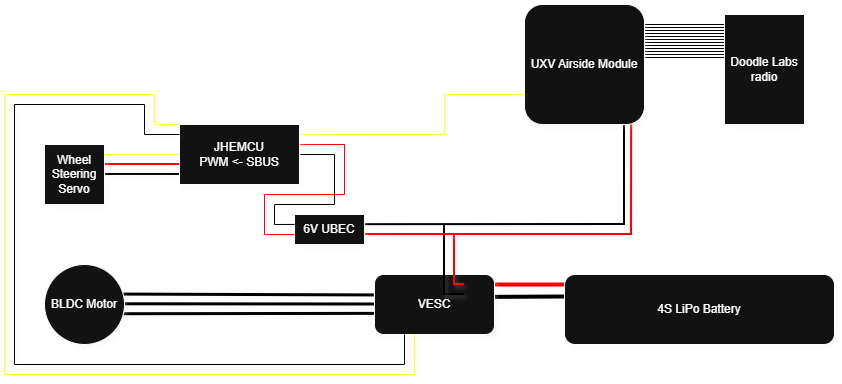

# Wiring for Control of Unmanned Vehicle using SBUS

## Parts List:

* 1x UXV Micronav Dev Kit (or another controller with SBUS output)
* 1x UXV Airside Integrated Module (firmware > v2.0.0)
* 2x Doodle Labs radios with working connection
* 1x JHEMCU SBUS to PWM converter
* 1x 5V UBEC
* 1x VESC (open-source electronic speed controller)

## Consumables List

* Min 5x 2-Pin connectors of your choice, this guide uses XT60/XT90 (male and female)
* Min 3x Bare pin connectors, this guide uses 4mm bullet connector (male and female)
* Min 0.5m AWG10 cable
* Min 1m AWG16 cable
* Min 3x 3-Pin servo connection leads (both male and female)

## Tools List:

* Soldering Iron (recommended at least 100W)

## (Optional:)

* 4x 20dB attenuators for bench testing of Doodle Labs radios
* Bench power supply&#x20;


Note: This guide is building upon a TRAXXAS MAXX rc car, which already has a BLDC motor and battery.


## Connection Diagram

<figure><figcaption></figcaption></figure>
