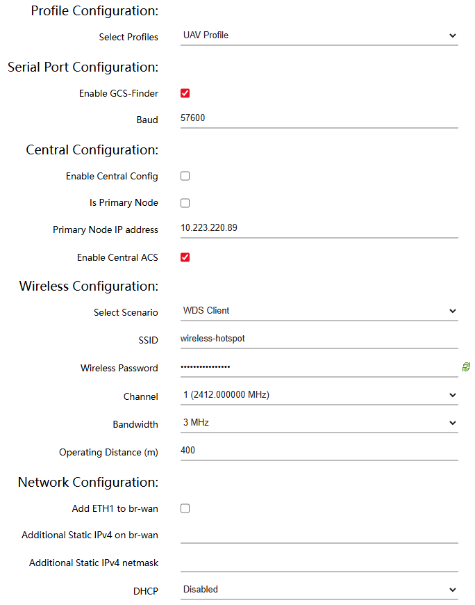

# Configuring the DL Radios Connection

Part List:

* 2 Doodle Labs Radios with antennas and working connection to a computer through ethernet cable (check [this](https://docs.google.com/document/d/1zot5UUsQdsEH8KkXq8VFGMw3t8RH3kEaSKkXSnUKDaE/edit?tab=t.0) guide)


Please note that this guide focuses on the Point-to-Point communication, which establishes a direct link between two radios. Types of use-cases can be found [here](https://kb.doodlelabs.com/drone-performance-use-cases).


### 1 Preliminary Steps

Start by powering both of the radios on (for example by connecting both of the cables to a power supply and setting the current limit higher). Connect at least one of the radios to a computer through an ethernet cable, ideally both at the same time for quicker debugging.

Log into the web GUI for the radio that you are setting up. Navigate to simple configuration - simple configuration and select the appropriate settings. Each of them are explained in the next section.

<figure><figcaption>
Simple configuration tab in the Web GUI, firmware version: May 2023 (LST)
</figcaption></figure>


Expected outcome: Open web GUI page where settings can be accessed.


### 2 Explanation of the Settings


This section explains the settings required for a optimized link. It is recommended to configure them based on your own needs, however if you just want a working link between a UAV and GCS, which is optimized for reliability, scroll down and copy the settings from the screenshots.


_**Profile Configuration**_ - A pre-built template optimized either for a Ground Control Station (GCS) or an unmanned vehicle (UAV). In simple terms, the GCS configuration makes all of the traffic of the network go through the radio with this setting, while the UAV profile makes the radio act as a single node.

_**Serial Port Configuration (on UAV radio only)**_ - Converts UART signal from a flight from a telemetry port to UDP packets and sends them over the network. The configuration is described in detail in the UART Guide.

_**Enable Central Config**_ - The configuration of the radio will be pushed to all of the other radios on the network. This makes sense for a GCS, however this guide focuses on configuring both of the radios individually.

_**Is Primary Node**_ - This designates the radio as the reference point for network-wide settings such as the chanell selection. Only one radio on the network should have this setting enabled.

_**Enable Central ACS**_ - Enables automatic Channel selection, which is a process where the primary node scans the spectrum for the least congested frequency chanell and switches all of the nodes on the network to it.&#x20;

_**Scenario**_ - Can be either set to [mesh](https://en.wikipedia.org/wiki/Wireless_mesh_network) or [WDS](https://en.wikipedia.org/wiki/Wireless_distribution_system). In a mesh all of the radios are equal and can talk to each other directly or through other radios if a link is not available. WDS configures one radio as an access point onto which other radios connect and communicate through.

_**SSID**_ - Network name, must be the same for all radios that communicate with each other.

_**Password**_ - Must me again the same for both of the radios.

_**Channel**_ - Every frequency band (a slice of the Radio Frequency spectrum assigned to a specific use, for example 2.4 GHz) is divided into several channels so that several users can share the same spectrum without interfering with each other. The channels are spaced equally within the frequency band. It is best to choose the least congested channel (if you know which). Both of the radios have to be on the same channel.


Note that if ACS is enabled, this setting might be overridden and the radios will automatically select the least congested channel.


[_**Bandwidth**_](https://en.wikipedia.org/wiki/Bandwidth) - The difference between the upper and lower frequencies used centered around the chanell frequency. The explanation is beyond the scope of this guide, however a few basic rules apply. A larger bandwidth can carry more information. On the other hand a wider channel is more likely to overlap with neighbouring channels, increasing susceptibility to interference and packet loss.. For the most reliable communication set the bandwidth as low as possible. If you wish to stream a lot of data at the same time and accept a higher loss, it is advantageous to set the bandwidth higher.

_**Operating Distance**_ - This setting does not control the transmit power. It only determines the time a radio waits for an acknowledgement that each of the packets was received.

_**Add ETH1 to br-wan**_ - If enabled, this settings bridges the second ethernet port to the bridge-wide area network (br-wan) making it accessible from other radios, not just the local area network (lan) on the one radio itself. Keep in mind that ETH1 is the second Ethernet port as the numbering starts from 0 and ETH0 is the first one.

_**Additional Static IPv4 on br-wan**_ - This lets you assign another IP address to the same interface making the radio reachable on two different addresses.

_**Additional Static IPv4 netmask**_ - Defines the size of the subnet that the additional IP above belongs to.

_**DHCP**_ - A networking protocol that enables automatic IP address assignment on the network. In client mode, the radio asks another device (server) to assign it an IP address. In server mode, the radio is the one doing the assigning and when disabled only the static IP addresses set above are used.

_**Traffic Prioritization**_ - For the scope of this guide, keep the default settings. It is a system which decides which packets are sent first when traffic is congested. Currently it is set to the highest priority.

### 3 Functioning Setup &#x20;

A functioning setup of the ground control station (GCS) radio can look like this for example:


These settings should give you the maximum range and reliability at the cost of throughput, if you wish to analyze the settings further, please check the next guide.


<figure><figcaption></figcaption></figure>

And the equivalent setup for the unmanned aerial vehicle (UAV) radio like this:

<figure><figcaption></figcaption></figure>


Expected outcome: The radios can communicate with each other.


### 4 Verifying the connection

To verify that the radios are communicating with each other, you can use several approaches:

#### A - Pinging the radios

Radios, which have a working link will create a network between each other. This means if you have one connected through ethernet to a computer, the other one will be acessible as if it were connected too. Therefore if you open the console you will be able to ping the other radio.

<figure><figcaption></figcaption></figure>

#### B - Mesh Map

The radios have a feature, which allows the user to display a topology map of the entire network once enabled. To open the map, navigate to the Web GUI - Status - Mesh Map. In a point-to-point connection between two radios, you should see two points connected with a line.

<figure><figcaption></figcaption></figure>


The color of the line connecting the two dots representing the radios indicates the link quality ranging from good (green) through medium (orange) to bad (red).



Expected outcome: Two radios can communicate with each other and the connection between them has been verified.

