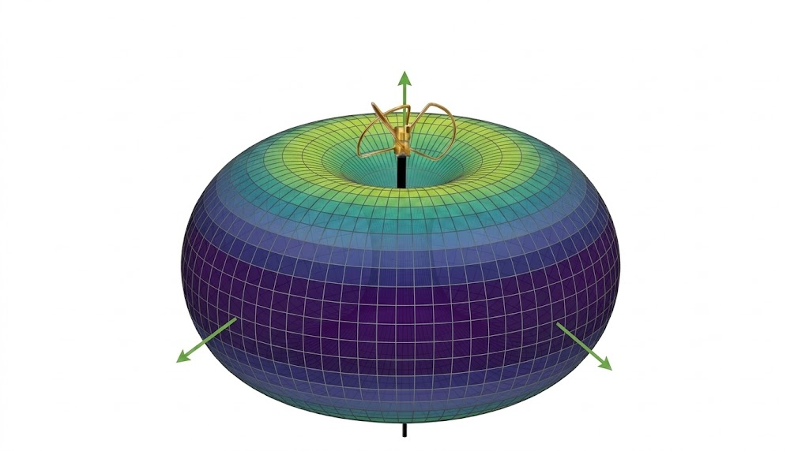
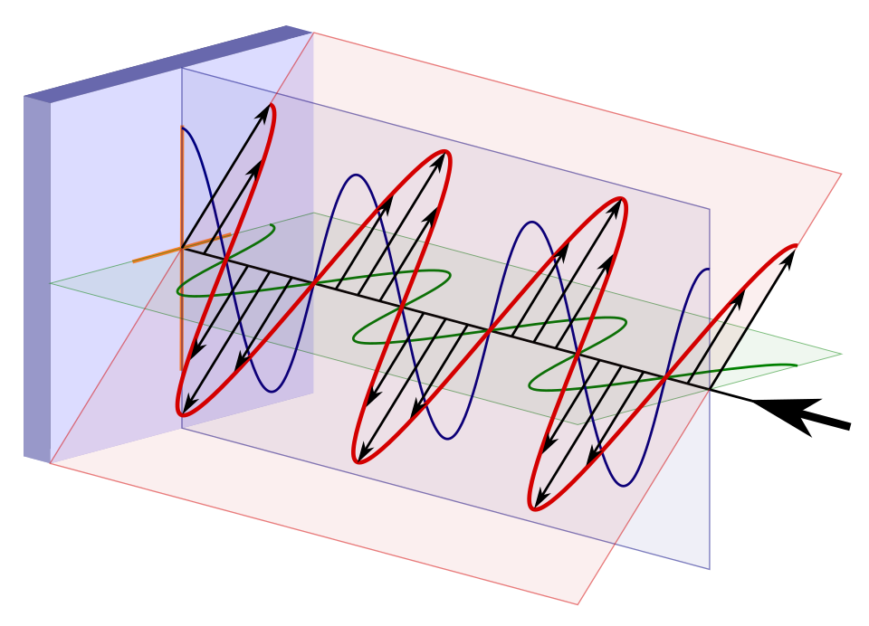
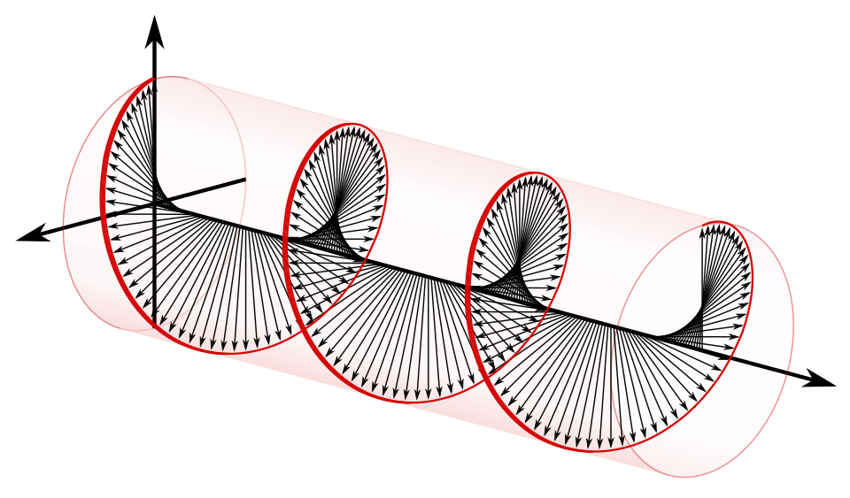

# Foundational Concepts

### Radiation Pattern

The RF signal is essentially a high frequency sound. And in a similar way normal sound can be focused when coming out of a speaker, RF signal can also be focused using an antenna. When sound is focused in a certain direction, it can be louder in that direction, however it will be quiter from all other ones.

The radiation pattern is a 3D graphical representation of how such a power distribution might look. as shown by some examples.

<figure><figcaption></figcaption></figure>

### Antenna Gain

Antenna gain is a single number explaining the strongest direction of the radiation pattern, compared to an ideal antenna radiating equally in all directions. The function expressing the antenna gain is logarithmic.

The choice of appropriate antenna gain is dependent on the use-case.

<figure><figcaption></figcaption></figure>

It is pretty common to combine two types of antennas in one link, for example to use a high-gain for the GCS antenna as the drone will generally only fly in one direction, and a low-gain antenna on the UAV so that the signal signal is independent of the drone orientation. Some setups even combine two types of antennas on the receiver side.

### Antenna Polarization - Linear or Circular


The antenna polarization pattern is independent of the antenna radiation pattern.


The radio signal consists of an electric and magnetic field oscillating perpendicular to each other. When describing antenna polarization, we are focusing on the direction of the electrical field.



<figure><figcaption></figcaption></figure>



<figure><figcaption></figcaption></figure>



In the image on the left, we can see a linearly polarized antenna, while the circular antenna is on the right side. The main thing to look at here, without going too much into antenna theory, is the red plane. In the case of the linearly polarized antenna, it is the 45 degree angle one, and in the case of circularly polarized one, it is the cylinder. That is the plane depicting the signal.

Linear polarization can, in general terms, provide extra range, as the energy is focused on a single plane, not a cylindrical pattern. On the other hand, it also means that both of the transmitting and recieving antennas need to be alligned at the correct angle in order to achieve maximum overlap. In practical terms, this can mean that when a drone is turning in the sky, it may reduce link quality significantly.

For this reason, cyllindrically polarized antennas tend to be more popular for drone pilots, as they will get the same signal strength, no matter the angle of a drone.

It is also important to note, that there are two types of circular polarization antennas, left hand (LHCP) and right hand (RHCP) ones. This can be imagined as the ''spin'' direction of the circular signal and it is important that both of the antennas are using the same one.

