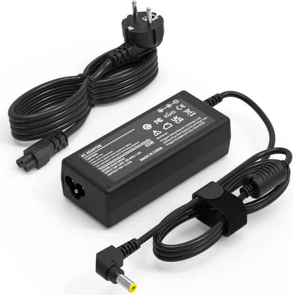
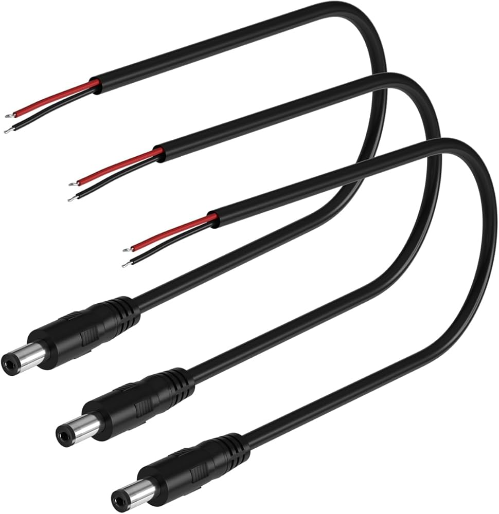

# Physical Connection with an Evaluation Board

Part List:

* 2 Doodle Labs radios - One for the Ground Control Station and the other for the unmanned vehicle.
* 4 or 2 Antennas - Usually 2 per radio, 1 for the Nano variant.
* Connectors for the DL Radios - Can be found in the documentation, read further.
* Ethernet Cable (+ adapter) - For connecting the radios to a PC for configuration.
* Doodle Labs Evaluation Board for the radio - Makes the process simpler.
* Power Supply for the Evaluation Board - To power on the radio.

Tools List (Depending on the type of Evaluation board):

* Tweezers - To modify connectors.
* Cables
* Connectors - This guide uses XT60.
* Wire Stripper - You can also use fingernails for thin ones, around [24 AWG](https://en.wikipedia.org/wiki/American_wire_gauge#Tables_of_AWG_wire_sizes) max.
* Soldering Iron + Consumables

### 1. Locating the Documentation

Begin by locating the documentation the radio on the website based on the radio model number, which is written on its label. The general naming convention for all doodle labs radios except the nimble variant dictates the name starts with RM followed by the part number (RM-XXXX-XXX) or they might be referred to by their marketing name such as Helix, Nano etc. In some cases, the radios might have been discontinued by Doodle Labs and it is necessary to look up the documentation in the [Legacy Product Index](https://techlibrary.doodlelabs.com/legacy-products).



<figure><figcaption>
Label on RM-2450-2J-XM
</figcaption></figure>



<figure><figcaption>
Label on RM-2025-62M3
</figcaption></figure>




Expected Outcome: Located documentation (link/pdf) for the radio model.


### 2. Physical Connection


If you wish to connect a Doodle Labs radio without an evaluation board, follow [this](physical-connection-without-an-evaluation-board.md) guide.



For the setup of the radio, it is recommended to use an ethernet connection through a cable to a computer. This method works on all types of radios and is the most reliable. This guide focuses only on this method. It is also possible to use an USB, UART or WiFi connection, however this method might not be available on all types of radios. For example the Wifi connection, where the radio sets up a wifi network to which it is possible to connect, is only available on the Wearable and OEM radio variants.



Make sure to always connect the antennas to the radios, which needs to be done before powering on the radio otherwise there is a risk of damaging the internal electronics. Afterwards it is safe to start connecting the power and ethernet to the radio.&#x20;


#### 2.1 Connecting the Evaluation Board

To simplify the process of connecting and testing a Doodle Labs radio, it is reccomended to purchase the Evaluation Test Kit for the radio you wish to use. The kit contains all of the specialized cables and other quipment you will need, including the Evaluation Test Board. The list of Kits for every radio can be found [here](https://techlibrary.doodlelabs.com/quick-start-guide-ch1).

<figure><figcaption></figcaption></figure>

Such a board significantly simplifies the process of powering up and connecting a DL radio to a computer as it has dedicated power and ethernet cable ports. It is then only necessary to use the correct cable to connect the board to the radio. The boards do however not come with a power supply.

#### 2.2 Powering the Evaluation Board

Before connecting anything, make sure to first determine the correct voltage rating for the radio, which can be found in the documentation. Some radios will have a specified number (5V for the DL Mini), others will have a range (6V - 42V for the DL Embedded - legacy product). If you connect the wrong voltage, the radio will either not work or you will burn some components.

<figure><figcaption></figcaption></figure>

Then you will need to find the power pins or connectors on the board. Some boards have only pins labelled + (equivalent: VCC and VDD) and - (equivalent: GND), others will have a dedicated connector, such as the 4.5 mm barrel jack.

#### 2.2.1 Powering the Evaluation Board with a Laptop-style Power Supply

If you wish to use a dedicated connector, either use a power supply (for example a laptop one) of the correct voltage rating.

<figure><figcaption></figcaption></figure>

#### 2.2.2 Powering the Evaluation Board with a Bench Power Supply

The other option is to use a bench power supply. In this case you will need to use the connector wil cables already attached/soldered to it. An example with a 4.5 mm Barrel Jack is shown in the image.

<figure><figcaption></figcaption></figure>

If you do not have one, you can simply cut an existing cable and strip the end of the wires inside of it of the plastic around them. Afterwards locate the positive and negative wire. Some connectors might have an obvious indication. However in most of the cases you will need to find the pinout of the connector online and then use the ohm check on a voltmeter to locate the cable connected to the respective pins you are looking for.

If the evaluation board does not have a connector, they will have at least + and - pins. Sometimes the board has a [push in terminal block](https://caas.phoenixcontact.com/caas/v1/stable/media/33656/full/b700?format=jpg), into which a stripped cable can be simply inserted to establish a connection. Other boards have just exposed pins onto which a cable needs to be soldered.

Then continue by connecting these cables to the power supply pins. Keep the standard convention for cable colors, where the positive (+/VCC/VDD) is red and the negative (-/GND) is black.

<table data-card-size="large" data-view="cards"><thead><tr><th></th></tr></thead><tbody><tr><td></td></tr><tr><td></td></tr></tbody></table>

Lastly set the power supply to the correct voltage for the radio along with a sufficiently high current limit to deliver a maximum of 15 Watts.


Power (Watts) = Current (Ampers) \* Voltage (Volts)


However do not set it too high as if there is a wiring mistake, there is a higher chance of immidiately burning something. The radio will draw as much current as it needs, if it draws more, it will trigger the current limit and the voltage will start dropping. If the radio draws more then 15W, there is probably something wrong.


Expected Outcome: Power can be delivered to the evaluation board.


#### 2.3 Ethernet and Radio Connection

To prepare the ethernet connection between the doodle labs radios an the computer, plug in all of the required connectors between the doodle labs and the evaluation board. An example of what that can look like is shown below.

<figure><figcaption></figcaption></figure>

Then use an ethernet cable to connect the computer and the evaluation board. This is usually done with the RJ-45 cable. In some other cases the connector is a 4-pin JST-GH, however, the evaluation kit should come with a reduction to the RJ-45 cable.

The resulting connection should look similar to the following:

<figure><figcaption>
Radio With an Evaluation Board in a DIY Case to avoid Short Circuits
</figcaption></figure>


On most of the radios, there is no indication of the radio working correctly after being powered on. Most of times you have to connect to them on the computer to verify they work. However a good indication of the radio working correctly is the power draw, which should be about 2W in the idle state.



Expected Outcome: The Doodle Labs is physically connected to a computer, powered and ready to be configured.

