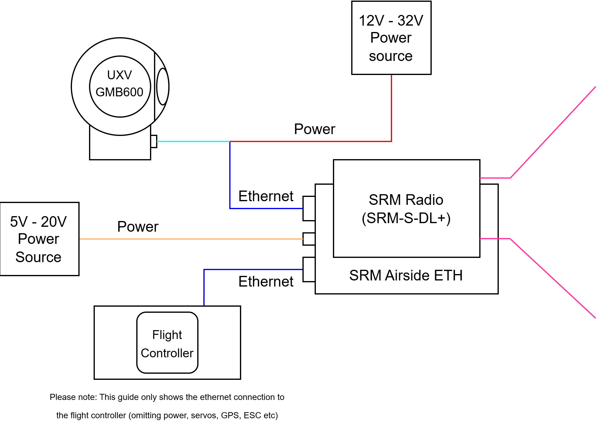

# GMB600 Mounting and Wiring Ethernet


This guide explains the process of integrating a the Optroxa GMB600 into an unmanned vehicle with other UXV Technologies products using the ethernet connection.


### Part List:

* 1x Optroxa GMB600 Gimbal
* 2x SRM Radios
* 1x SRM Airside ETH (or other equivalent SRM Airside module that will act as a switch)
* 1x SRoC Controller
* 1x Vehicle with a flight controller

### Cable List:

* 1x ODU A10WAM-P12XMM0-0000 to ODU G81 - 8 pin and Power (such as XT30) for connecting GMB600 to SRM Airside (UXV does not make one yet, coming soon)


This guide assumes that the SRM Airside ETH is set up according to [this guide](../swappable-radio-modules/srm-airside-eth-setup.md).


### 1. Explaining the architecture

<figure><figcaption></figcaption></figure>

This architecture, where the gimbal and flight controller are on the same network, is typical for an unmanned vehicle. The SRM Airside ETH acts as a switch, bringing both of the devices and the radio on the same network. This is advantageous for two reasons:

1. The video and telemetry stream are unified on one link, eliminating any redundancies of old systems where the streams were split.
2. The gimbal has a NVidia Jetson Orin Nano integrated in it turning it into an edge-compute node. By having the flight controller on the same network as the Jetson, [autonomy](../../explained-concepts/basic-autonomy-using-ros2.md) is enabled in the vehicle without having to strain the radio link by sending the data to the GCS for processing or adding an extra computing note, which would consume more power and increase the wiring complexity.


The UXV Technologies gimbal also has CAN pins exposed to allow the gimbal to control other devices and UART for&#x20;


Below is the wiring diagram of the complete vehicle that UxV Technologies used for testing.

<figure><figcaption></figcaption></figure>

### 2. Stream Data to Custom QGC+

Finish this section based on information from Andy.
