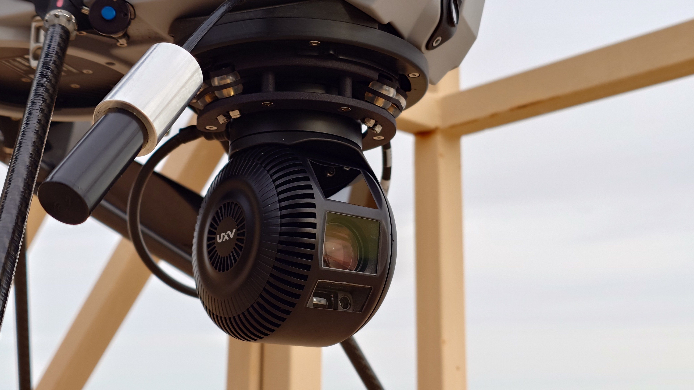

# GMB600 Wiring and Setup

<figure><figcaption></figcaption></figure>

Part List:

* Optroxa GMB600 Gimbal
* ODU A10WAM-P12XMM0-0000 to RJ-45 (or any other ethernet) and power combo cable

### 1. Connect the GMB600 to power and ethernet

Connect the gimbal cable into&#x20;

