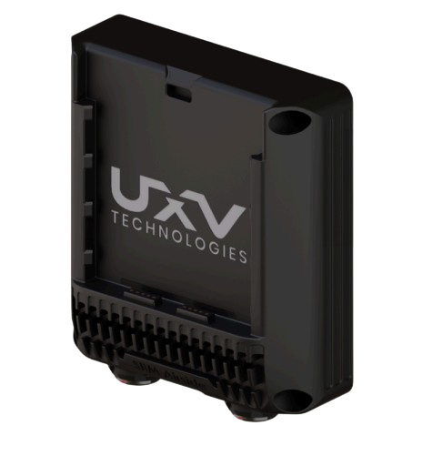
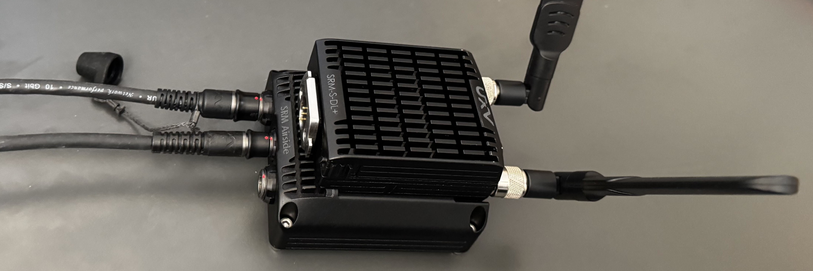
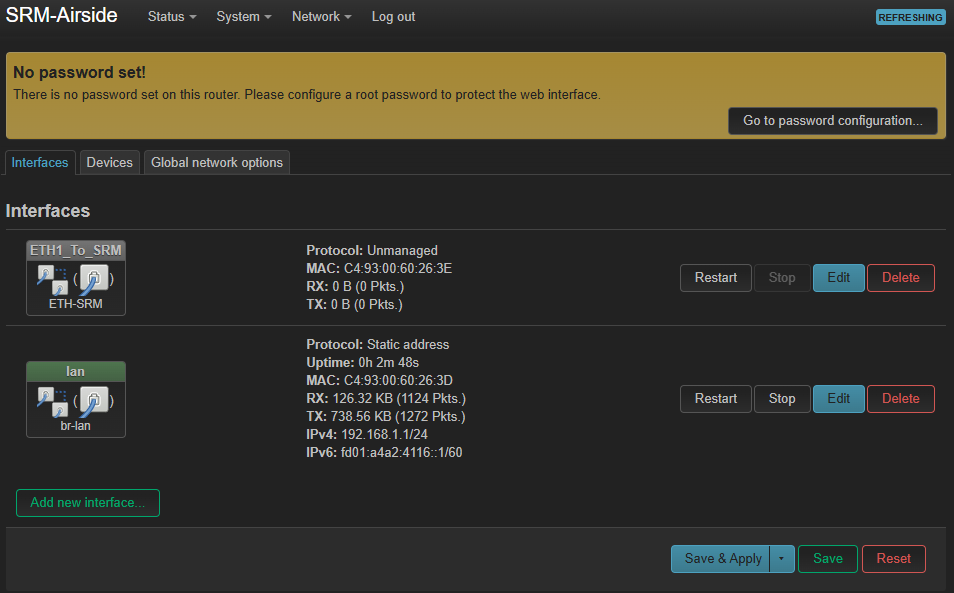

# SRM Airside ETH Setup

<figure><figcaption></figcaption></figure>

## Part list:

* SRM Airside ETH
* 2x SRM Radio (This guide uses SRM-S-DL+)
* 1x ODU S11YAR 8 Pin to 4-pin JST-GH1.25 with ETH pinout
* 1x ODU S11YAR 8 Pin to whatever the GMB600 connector is
* 1x ODU S10YAR 10 Pin to XT60 (or other power connector)
* 1x UXV SRoC

Optional Components/Tools:

* SRM Dock with Xt30 and USB-A - Used for configuration/debugging of the SRM

### 1. What is the SRM Airside ETH

The SRM Airside is a linux computer running OpenWRT, which is a linux-based operating system built for routers and other embedded network devices. This way it can act as a switch for the radio and other ethernet connections.

It has the following physical ports:

* 2x Ethernet on the ODU G81 - 8 pin
* 1x Ethernet in the SRM slot
* 1x Power and UART on the ODU G80 - 10 pin

By default, the first ethernet port on the side is set as a configuration port to directly access the SRM Airside ETH. The second ethernet port is set as a passthrough port for the SRM slot.

<figure><figcaption></figcaption></figure>

### 2. Connecting to the SRM Airside ETH

Locate the ethernet port set up for configuration. Connect a cable from the SRM Airside ETH configuration port (ODU S11YAR 8 Pin) to an ethernet port on your computer. An example of the cable UXV used is pictured below:

<figure><figcaption></figcaption></figure>

Then connect the power cable to the middle connector (ODU S10YAR 10 Pin) and power on the SRM Airside with 5V to 20V.&#x20;


To prove that the SRM airside is being powered on, put an SRM into the radio slot and observe its power status LED after turning the power switch to ON.


<figure><figcaption></figcaption></figure>

Make sure that the IP 192.168.1.1 is within the IP range of your network adapter. For information on how to configure it, follow this [guide](../../doodle-labs-connection-setup/connecting-doodle-labs-to-a-pc-windows.md).

After about 60 seconds, the SRM Airside ETH is fully booted up and you can connect to it at 192.168.1.1. The easiest way to do it is through a web browser to access the LuCi web interface. The webpage should look something like the following upon loading:

<figure><figcaption></figcaption></figure>


If you cannot connect to the SRM Airside ETH, try the following (in order):

1. Try the other ethernet port on the SRM Airside ETH.
2. Make sure that your computer and the SRM airside are on the same subnet. Sometimes there is an IP mismatch which prevents a connection.
3. Try to ssh into the SRM Airside ETH through the terminal (ssh root@192.168.1.1). If it works but you cannot acces the web GUI, try clearing browsing cache. Certain internet browsers will block a connection after several attempts.


From this point, the SRM Airside ETH can be configured based on customer needs&#x20;

### 3. Settings Rationale

The settings described in step 4. will set the device as a multi-homed router. The following is the reasoning behind it.


A multi-homed router is a router equipped with multiple network interfaces, each of them connected to a different network or a subnet. This allows it to relay traffic between those separate networks, meaning only the target device gets the information without the whole network being flooded by it.


The goal of this setup is to have the SRM Airside ETH function as a DHCP server and assign IP adresses to various devices on the network based on the ports they are connected to. This way the IP of the devices are always the same, which allows the radio, flight controller, or the gimbal to be swapped and the routing will not break.&#x20;


The device is configured to assign IP adresses on the 10.224.1.1/16 (10.224.x.x) network because Doodle Labs radios function on the 10.223.0.0/16 and giving it another adress on 10.223.0.0/16 would cause an IP overlap and break the connection. Therefore it is possible to use any other adress except that one.


The following setup also divides the network into several segments. This way the packets are only forwarded between the sender and the destination. As a counter example, in a typical topology where all ports are bridged together, all devices receive all communication, which can cause issues in latency of important streams or overwhelm certain devices.


The current setup does not consider security as the firewall is set to forward all. If you wish to add security, it is reccomended to configure the firewall settings first.


### 4. Configuring SRM Airside ETH as a multi-homed router

To implement the settings, log into the web interface and navigate to Network - Interfaces.

<figure><figcaption></figcaption></figure>

The current settings should look like this:

<figure><figcaption></figcaption></figure>

Delete all of the interfaces and create new ones by clicking the "Add new interface" button. Set the basic parameters according to the ones below and click "Create interface."&#x20;

<figure><figcaption></figcaption></figure>

After the interface is created, edit it through the interfaces tab.

<figure><figcaption></figcaption></figure>

Continue setting all the rest of the parameters listed below:

1. Interface 1 - CAM\_Port
   1. Name: CAM\_Port
   2. Protocol: Static Adress
   3. Device: eth0
   4. General Settings - IPv4 address: 10.224.10.1
   5. General Settings - IPv4 netmask: 255.255.255.0
   6. Firewall Settings - Firewall zone: lan (all port interfaces are there)
   7. DHCP Server - General Setup - Start: 10
   8. DHCP Server - General Setup - Limit: 1
   9. DHCP Server - General Setup - Lease time: 12h

<figure><figcaption></figcaption></figure> <figure><figcaption></figcaption></figure> <figure><figcaption></figcaption></figure>

