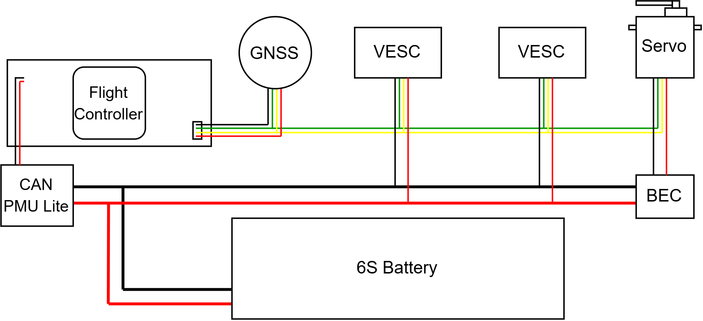

# Peripherals Wiring

## 1. GPS Connection


Connecting the GPS to the GPS\&SAFETY port enables the following

* Physical safety switch to prevent accidental arming (additional layer of safety)
* LED Pin for light status signaling (blinking = safe, solid = armed)
* Buzzer Pin for sound status signaling


It is reccomended to use the GPS\&SAFETY port on the flight controller to enable all of the following functions:

* Buzzer Pin for sound status signaling
* LED Pin for light status signaling (blinking = safe, solid = armed)
* Physical safety switch to prevent accidental arming (additional layer of safety)


The same result is achieved by connection to the CAN port, but with better EMI interference. It is the most optimal way of connecting a GPS, but not all modules support it.


&#x20;Examples of other port options (for various GNSS models):

* TELEM (UART + Power and GND + RTS/CTS)
  * Connecting a GPS to this port is typically done when the primary GPS port is already occupied with (for example when blending 2 GPS positions together for redundancy)
  * There is no I2C line for compass data
* UART
  * Same result as with TELEM, but does not waste RTS/CTS lines which would otherwise be idle
* GPS
  * Same as GPS\&SAFETY, but does not enable the safety switch.

## 2. Servos and UBEC

There are two main types of servos:

* DroneCAN/UAVCAN Servos (controlled using the CAN protocol)
  * Higher EMI resistance
  * Simplified wiring, especially for longer connections, as there is one cable connecting to the flight controller
  * Higher configurability, can set torque limits, travel limits etc withouth using external programmers.
* PWM Servos (Controller using Pulse Width Modulation)
  * Cheaper and more readily available
  * Extremely simple setup

### 2.1 Powering the Servos

The simplest way to power the servos is through the servo rail on the flight controller.&#x20;

<figure><figcaption></figcaption></figure>

Certain legacy flight controllers have this rail powered. Most of the modern ones however keep it disconnected from the flight controller power to protect the electronics from voltage spikes. The servo rail therefore has to be powered externally.

This is most commonly done through a dedicated Battery Eliminator Circuit (BEC), which steps down the voltage from the main battery. A popular alternative is an ESC with a BEC integrated into it.


Some hobby autonomous vehicles have a dedicated battery to power the electronics of an unmanned vehicle. While this source of power is separated from any disruptions caused by ESC voltage spikes, it introduces another layer of complexity as two batteries need to be monitored separately and it is not common in the industry nowadays.


<figure><figcaption></figcaption></figure>

Connect the BEC output to any terminal on the servo rail. All of the pins are connected together, meaning a power input to one pin spreads to all of the others.&#x20;

If you wish to power the servos at a different place in the vehicle, simply connect the wires to a BEC output in parallel.

### 2.2 Connecting through PWM

To connect the servo through PWM, connect the signal cable from the servo to the signal pin on the flight controller servo rail.&#x20;

### 2.3 Connecting through CAN

Since there are usually just one or two CAN ports on the flight controller, more than one peripheral need to be daisy chained together.


If the flight controller and VESC are connected to the same battery, you do not need to connect the GND and 5V cables as they already share these through the battery.


Ideally, the cable should be terminated exactly at the port of the node, where another cable is starting again. In reality, there will likely be one main cable going from beginning to the end, which is called the "trunk" with short cables going from it to the CAN nodes called a "stub".

For a CAN connection to work properly, individual "stubs" should not exceed 30 cm in length. The combined length of all "stubs" should not exceed 1.5m. Below is an example of what such a connection might look like.

<figure><figcaption></figcaption></figure>

## 3. VESC

#### 2.4 Flight Controller Power Module
