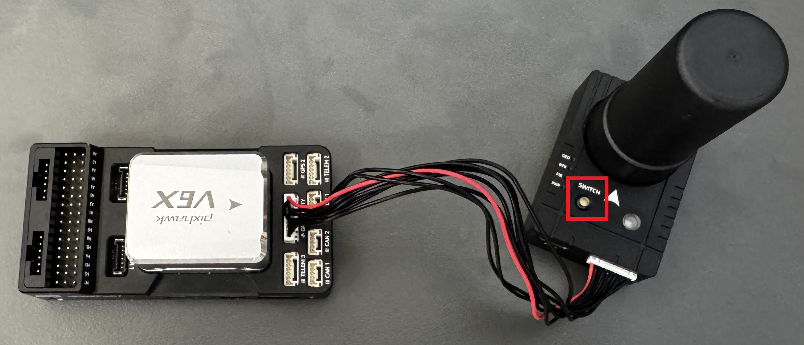
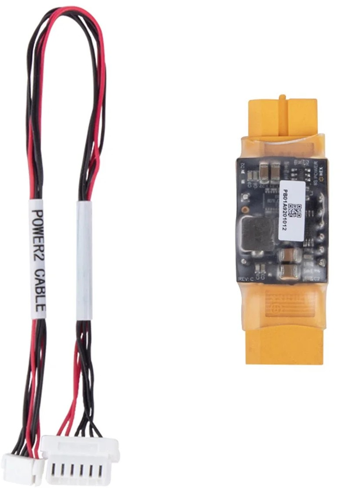
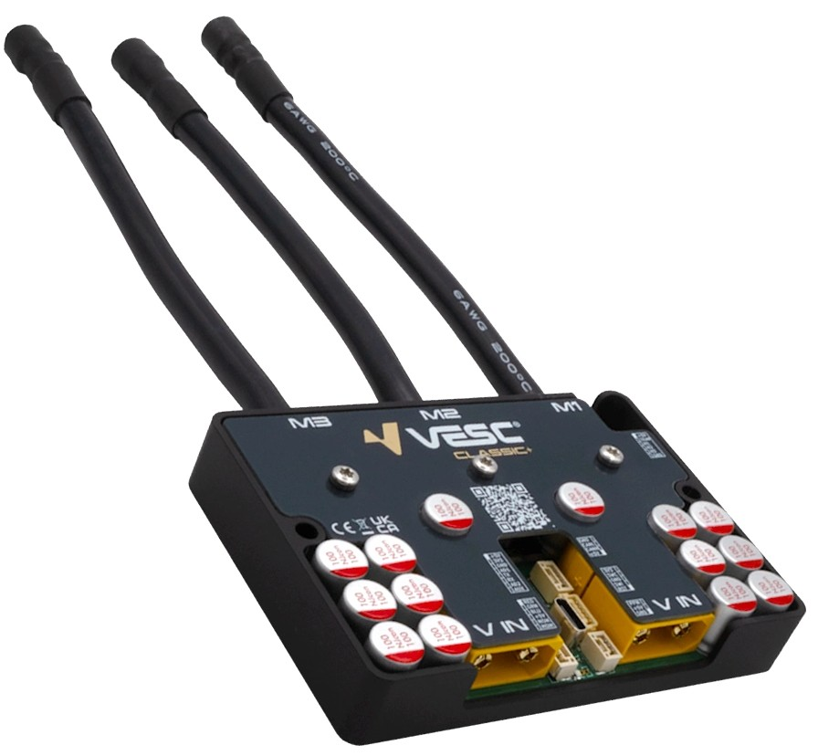

# Setting up an ArduPilot Vehicle

## Part List:

* Flight Controller (this guide uses CUAV V6X)
* GNSS (this guide used Here4)
* Servo (optional amount)
* 1x CAN PMU (or any other unit to power the flight controller)
* 5V UBEC (amount depends on number of components)
* 6V UBEC (amount depends on number of components)

## Optional Part List:

* VESC (optional amount - keep in mind the required 120Ω resistance requirement) or any other ESC
* BLDC Motor (most common type)


This guide uses Ardurover v4.7.1 and Mission Planner v1.3.83&#x20;


## Tool List

* Windows Computer with Mission Planner installed (this guide uses Windows 11)


Even though Ardupilot is also supported on QGroundControl, Mission Planner has been buit specifically for the purpose and will work better.


## 1. Flash the Flight Controller with Firmware

Start by connecting the Flight Controller to your computer via USB and open Mission Planner.&#x20;

<figure><figcaption></figcaption></figure>

In Mission Planner, select the correct COM port in the top-right corner and click connect.&#x20;


If you need to find out to which COM port the flight controller is connected to, open Device Manager on your Windows computer. Open the "Ports (COM & LPT)" drop-down. Now connect the flight controller and notice which port appears, which is the one the flight controller is connected to.

.png>)


<figure><figcaption></figcaption></figure>

Continue by navigating to "Setup" - "Install Firmware". A screen will appear stating that firmware cannot be loaded while connected via MavLink and asking the user to click on "Disconnect" in the top right corner. Click on it and a screen with possible versions appears.&#x20;

<figure><figcaption></figcaption></figure>

<figure><figcaption></figcaption></figure>

Select the correct ArduPilot distribution for your use case.&#x20;

* [Rover](https://ardupilot.org/rover/) - Use for ground vehicles (cars, tracked vehicles) and surface watercraft.
* [Plane](https://ardupilot.org/plane/) - Use for Fixed-Wing (airplane, glider, flying wing) and Hybrid Aircraft (Quad-Plane VTOL)
* [Sub](https://ardupilot.org/sub/) - Use for underwater vehicles (ROV, UUV etc).
* [Antenna Tracker](https://ardupilot.org/antennatracker/) - Use for Ground Control Station (GCS) directional antenna hardware.
* [Various Copter Frames](https://ardupilot.org/copter/)
  * Quadcopter
  * Hexacopter
  * Helicopter
  * Octo-Quad (Coaxial Quad)
  * Tricopter
  * Y6 Coaxial
  * Octocopter

For this use-case, UXV Technologies will flash the Flight Controller with the Rover build. A window will open, prompting the user to select the correct Flight Controller platform. In this case, the basic Pixhawk 6X has been selected.

<figure><figcaption></figcaption></figure>

Continue by clicking "Upload Firmware". After the initial setup, a prompt will pop up asking to disconnect and reconnect the Flight Controller and hit the OK button within 30 seconds.

<figure><figcaption></figcaption></figure>

After the firmware has been uploaded, the COM port the Flight Controller is connected to will very likely change if you uploaded a different firmware. This time however, Mission Planner will recognise the port and mark it as MavLink. Select the port in the drop-down menu and click on "Connect".

<figure><figcaption></figcaption></figure>


The SLCAN option will turn the Flight Controller into a pass-through USB-to-CAN adapter, allowing you to talk directly to a peripheral device connected to it.&#x20;


## 2 Connect Peripherals

For further setup, it is best to connect the peripherals you wish to use on the final build to directly test the settings. In this guide UXV Technologies used:

* 1x Holybro GPS connected to GPS\&SAFETY
* 1x DroneCAN/UAVCAN ESC (VESC)
* Servo connected through the servo rail
* 5V voltage step-down module to power the servo
* 1x CAN PMU (or equivalent power module for the flight controller) if you are using an ESC which does not send power information

### 2.1 GPS on GPS\&SAFETY

The GPS\&SAFETY is automatically configured to work accept position and compass data, therefore no setup should be required to connect the GPS.

It however enables the GPS Module to be used as a:

* LED Status indication
* Sound status indication
* Safety switch that prevents accidental arming and disables output to all motors and servos

All of these functions should be enabled by default upon connecting a compatible GPS to the GPS\&SAFETY port.


When the safety switch is engaged, you should see a message PreArm: Safety Switch (after you have a radio link). To arm the aircraft using the safety switch, press and hold it for 2 seconds. The light on the GPS should change color and you should be able to arm the vehicle.


<figure><figcaption>
Safety Button on the Holybro H-RTK F9P Helical
</figcaption></figure>

### 2.2 DroneCAN/UAVCAN ESC


This guide uses an ESC based on the VESC Omega running v6.06 of the firmware.


Begin by setting the baud rate of CAN for the flight controller and the UAVCAN ESC. For example, the settings UXV Technologies is using:

CAN\_D1\_PROTOCOL = 1

CAN\_D1\_UC\_NODE = 1 (different than the VESC node ID)

CAN\_P1\_BITRATE = 1 000 000 (depends on use case)

CAN\_D1\_UC\_BM = 1

BATT\_MONITOR = 9 (for ESC, not DroneCAN)

To see if the flight controller can recognize the ESC connected, follow the next step while connected to the flight controller. Navigate to Setup - Optional Hardware - DroneCAN/UAVCAN in Mission Planner. Select MAVLinkCAN1 if your ESC is conencted to CAN1 port, or MAVLinkCAN2 respectively, from the drop-down and click on "Connect".

<figure><figcaption></figcaption></figure>

You should see the ESC with the node ID it is set to.

<figure><figcaption></figcaption></figure>

The ID of the ESC does not really matter as long as it is unique. It should also not take any of the numbers assigned to the Flight Controllers or Ground Control Stations - 1, 10, 125, 126, 127.

Lastly, the motor output chanells have to be configured using the SERVOx\_FUNCTION. After writing the parameters, navigate to Setup - Optional Hardware - Motor Test.&#x20;

For the duration of the test, Ardupilot will quietly arm the vehicle and disarm it after the test without visually showing it. Therefore the motor test will fail if there are any problems, which would disable arming. For testing, you should set the ARMING\_CHECK = -1 to skip the checks. Be careful to check the errors (Data - Messages) in order to not destry the vehicle accidentally.

<figure><figcaption></figcaption></figure>


Remember to set the ARMING\_CHECK parameter and others you have changed temporarirly to the correct value before continuing with the configuration.



If you get the "Command was denied by the autopilot" error, try to:

* FS\_THR\_ENABLE = 0
* BRD\_SAFETYENABLE = 0 (disable safety switch, should turn solid red)
* Make sure the frame is set.


## 3 Battery Settings

Before choosing the source of battery data, set the following set of parameters according to your battery:

BATT\_LOW\_VOLT = If the voltage is below the set voltage for more than 10 seconds, the vehicle performs the action set by BATT\_FS\_LOW\_ACT. Setting this parameter to 0 disables it.

BATT\_CRT\_VOLT = The vehicle performs the action set by BATT\_FS\_CRT\_ACT, which is typically more agressive. Setting this parameter to 0 disables it.

BATT\_CAPACITY = The capacity of the battery in mAh when full.

You can set more parameters in the BATT drop-down in Mission Planner - CONFIG - Full Parameter List - BATT:

<figure><figcaption></figcaption></figure>

After setting these parameter, select the source of the battery information by setting the BATT\_MONITOR parameter. Optionally you can set this data in Setup - Optional Hardware - Battery Monitor.&#x20;

<figure><figcaption></figcaption></figure>

The following is listed in the order of accuracy.&#x20;

### 3.1 Data from Power Module



<figure><figcaption></figcaption></figure>



<figure><figcaption></figcaption></figure>



Most power modules not only send current and voltage information to the Flight Controller, but also provide it with a stable power supply. This way the power module reduces the risk of a flight controller brownout in an event of a voltage spike.

The power modules usually do not need to be configured, which significantly reduces the complexity of the setup.&#x20;


In order to provide accurate current reading, most of the standard power modules have to be connected between the battery and the ESC. An exception are Hall-effect sensors which measure the magnetic field induced by the current.


### 3.2 Data from DroneCAN ESC

<figure><figcaption></figcaption></figure>

ESCs already collect data about the voltage and current, which can be sent to the flight controller over CAN if the ESC enables it. The devices however usually differ in the amount of information the send over to the flight controller.

Set BATT\_MONITOR = 9 if the DroneCAN device is sending only voltage and current data, which the flight controller will use to calculate the battery percentage. This is typical for ESCs, such as the VESC.

Set BATT\_MONITOR = 8 if your DroneCAN devices is broadcasting BatteryInfo DroneCAN messages. This message includes not only the voltage and current, but also the battery percentage and is available only on specific ESCs. Usually the ones with a Battery Management System (BMS).

### Do not forget to add a tutorial for combining the battery currents if using 2 or more VESCs, each with its own current reading

### 3.3 Data from the Battery

## 4. Callibrate the Sensors

The sensors have to be callibrated to account for specific vehicle characteristics and geographic variables. Without a callibration being performed, an Ardupilot vehicle will refure to arm.

To callibrate them, open Mission Planner and navigate to SETUP - Mandatory Hardware. In the drop-down, you will see all of your sensors listed. Go through the settings one by one and perform the steps to callibrate the sensors.


For a lot of the sensors, you will be asked to rotate the Flight Controller in various directions. Be prepared to have space around yourself.


It is reccomended to callibrate the sensors after mounting them on the vehicle you plan to use. For example a metal frame or wiring nearby can cause slight disturbances in the magntic field which the callibration will account for.


If your vehicles has redundant sensors, such as a compass both in the Flight Controller and the GPS, make sure to have them in a fixed position relative to each other durin the callibration procedure.


<figure><figcaption></figcaption></figure>
