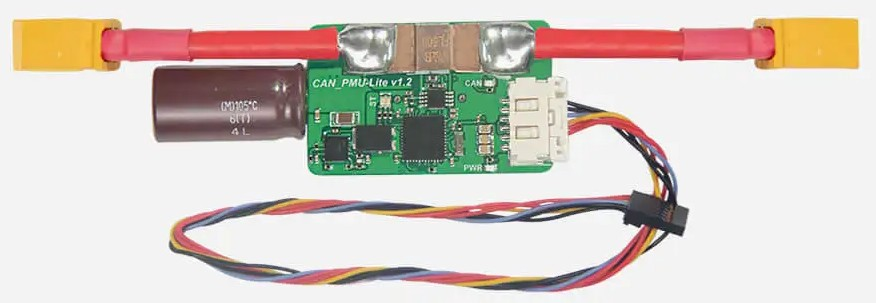

# Power Modules

## Flight Controller Power Module

The power module serves two purposes for a flight controller:

* Power the Flight Controller
* Send Voltage and Current data to the Flight Controller

<figure><figcaption>
CAN PMU Lite
</figcaption></figure>

While the flight controller can usually be powered on more than one ports. The most common one however is to use a dedicated power module. Some of the notable examples include CAN PMU Lite for CUAV contollers, or Power Brick Mini for CubePilot controllers.

The preffered option to get the Voltage and Current data from a flight controller is through DroneCAN/UAVCAN from an ESC, or directly from a battery. These options are however not always available. Therefore the power detection module has to be placed between the motors and the battery for accurate current readings.&#x20;


Note that the CAN PMU Lite and the Powe Brick Mini use different protocols to send the voltage and current information. Therefore it is possible that conencting the Power Brick Mini to a CUAV flight controller will not work, and it can even corrupt CAN data coming from other ports if you connect it to Power C1/C2 (ports using CAN).

