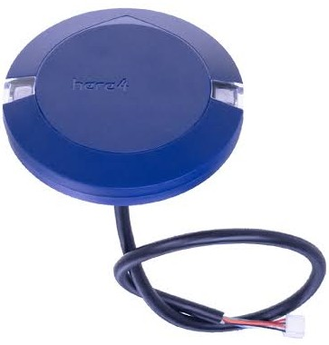

# GPS

## GPS Connection

<figure><figcaption>
Here4 Blue GNSS
</figcaption></figure>


Connecting the GPS to the GPS\&SAFETY port enables the following

* Physical safety switch to prevent accidental arming (additional layer of safety)
* LED Pin for light status signaling (blinking = safe, solid = armed)
* Buzzer Pin for sound status signaling


It is reccomended to use the GPS\&SAFETY port on the flight controller to enable all of the following functions:

* Buzzer Pin for sound status signaling
* LED Pin for light status signaling (blinking = safe, solid = armed)
* Physical safety switch to prevent accidental arming (additional layer of safety)


The same result is achieved by connection to the CAN port, but with better EMI interference. It is the most optimal way of connecting a GPS, but not all modules support it.

